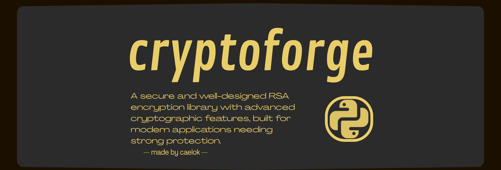

<!-- email: c.ogcae@engineer.com - cryptoforge:v1.0.2 - by ogcae !-->

<div align="center">
  <!--  !-->
</div>

<table>
<tr>
<td width="50%">

## quick start

```python
from CryptoForge import RSA


rsa = RSA()  ;  rsa.generate_key_pair(2048)

# encrypt and decrypt
encrypted = rsa.encrypt_text("secret message")
decrypted = rsa.decrypt_text(encrypted)
# ------ #

# digital signatures
signature = rsa.sign_message("document")
is_valid = rsa.verify_signature("document", signature)
# ------ #
```

</td>
<td width="50%">

## installation

```bash
git clone https://github.com/ogcae/cryptoforge.git
cd cryptoforge

# (optional)
pip install flask
```

**requirements:**
- python 3.7+
- standard library only (core functionality)
- flask (optional, for web demo)

</td>
</tr>
</table>

<table>
<tr>
<td width="50%">

## features

| feature | description |
|---------|-------------|
| **secure key generation** | 512-4096 bit rsa with cryptographically secure random |
| **pkcs#1 v1.5 padding** | industry-standard padding implementation |
| **multiple hash algorithms** | sha-256/384/512 digital signatures |
| **long text support** | automatic block splitting for messages of any size |
| **performance benchmarking** | built-in performance measurement tools |
| **interactive web demo** | browser-based encryption demonstration |

</td>
<td width="50%">

## examples

<details>
<summary><b>basic operations</b></summary>

```python
# key management
public_key = rsa.key_pair.export_public_key()
private_key = rsa.key_pair.export_private_key()
# ------ #

# load keys
rsa2 = RSA()
rsa2.load_private_key(private_key)
# ------ #

# long text encryption
long_text = "very long message..." * 1000
blocks = rsa.encrypt_long_text(long_text)
decrypted = rsa.decrypt_long_text(blocks)
# ------ #
```
</details>

<details>
<summary><b>advanced features</b></summary>

```python
from CryptoForge import RSAEngine, generate_safe_prime

# modular components
engine = RSAEngine()
safe_prime = generate_safe_prime(512, secure=True)
# ------ #

# performance analysis
benchmark = rsa.benchmark_performance(iterations=10)
print(f"encryption: {benchmark['avg_encrypt_time']:.4f}s")
# ------ #
```
</details>

**web demo:**
```bash
cd examples/apps/
python3 encrypted_website.py
# visit localhost:5000
```

</td>
</tr>
</table>

<table>
<tr>
<td width="50%">

## performance

| key size | generation | encryption | decryption |
|----------|------------|------------|------------|
| 1024-bit | ~0.1s      | ~0.001s    | ~0.01s     |
| 2048-bit | ~0.5s      | ~0.003s    | ~0.05s     |
| 4096-bit | ~5s        | ~0.01s     | ~0.3s      |

</td>
<td width="50%">

## security

- cryptographically secure random generation
- pkcs#1 v1.5 padding standard implementation
- miller-rabin primality testing with multiple rounds
- safe prime generation (p = 2q + 1)
- multiple hash algorithms support (sha-256/384/512)

</td>
</tr>
</table>

  
> [!TIP]
> Read [documentation](./docs/DOCS.md) & [license](LICENSE).
